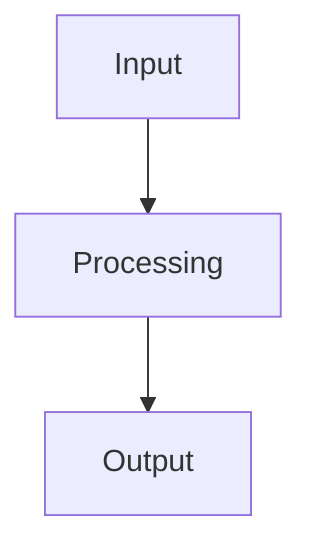

# Diagram Creation Tasks

Tasks for creating visual diagrams for the LLM course.

## Status Legend
- ⬜ Not Started
- 🔄 In Progress
- ✅ Complete

---

## Diagram 1: Architecture Diagram ⬜

**File**: `diagrams/architecture.md`

**Description**: Visual representation of the GPT model architecture

**Components to Show**:
- Input: Token IDs (batch_size, sequence_len)
- Token Embedding Layer (vocab_size, n_embd)
- Position Embedding (sequence_len, n_embd)
- Transformer Blocks (stack of n_layer blocks)
  - Layer Norm
  - Multi-Head Attention (n_head heads)
  - Residual Connection
  - Layer Norm
  - Feed-Forward Network (4 * n_embd hidden)
  - Residual Connection
- Output Head (n_embd → vocab_size)
- Final Output: Logits (batch_size, sequence_len, vocab_size)

**Format**: Mermaid flowchart

**References**:
- Code: `nanochat/gpt_mlx.py`
- Module 3 of COURSE_PLAN.md

---

## Diagram 2: Attention Mechanism ⬜

**File**: `diagrams/attention.md`

**Description**: How attention works (Query/Key/Value)

**Components to Show**:
1. Input: Token embeddings
2. Linear projections → Q, K, V
3. Multi-head split
4. Attention scores: Q @ K^T / sqrt(d_k)
5. Causal mask applied
6. Softmax → attention weights
7. Weighted sum with V
8. Concat heads + output projection
9. Final output

**Format**: Mermaid flowchart + ASCII art examples

**References**:
- Code: `nanochat/gpt_mlx.py:90-110`
- Exercise: `exercises/ex_3_3_attention.py`

---

## Diagram 3: Data Flow ⬜

**File**: `diagrams/data_flow.md`

**Description**: Complete data flow from text to generation

**Flows to Show**:

### Training Flow:
```
Raw Text → Tokenizer → Token IDs → Model → Logits → Loss → Backprop → Weight Update
```

### Inference Flow:
```
User Input → Tokenizer → Tokens → Model → Logits → Sampling → Token → Detokenizer → Output Text
```

### Components:
- Tokenizer (encode/decode)
- Model forward pass
- Loss computation
- Optimizer update
- KV cache (for inference)
- Sampling strategies

**Format**: Mermaid sequence diagram

**References**:
- Module 1, Module 5 of COURSE_PLAN.md
- `scripts/train_mlx.py`, `scripts/chat_cli_mlx.py`

---

## Diagram 4: Training Pipeline ⬜

**File**: `diagrams/training_pipeline.md`

**Description**: Three-stage training pipeline

**Stages to Show**:

1. **Pretraining**:
   - Data: Raw internet text
   - Task: Next token prediction
   - Output: Base model (knows language)
   - Duration: Days/weeks

2. **Supervised Fine-Tuning (SFT)**:
   - Data: Instruction-response pairs
   - Task: Follow instructions
   - Input: Base model
   - Output: Chat model
   - Duration: Hours

3. **Inference/Deployment**:
   - Input: User queries
   - Model: Chat model
   - Output: Responses
   - Optimizations: KV cache, batching

**Format**: Mermaid timeline + flowchart

**References**:
- Module 6 of COURSE_PLAN.md
- `scripts/train_mlx.py`, `scripts/sft_mlx.py`

---

## Implementation Guidelines

### Mermaid Syntax

Use Mermaid for all diagrams:



### File Structure

Each diagram file should contain:
1. Title and description
2. Mermaid diagram code
3. Explanation of components
4. Code references
5. Related exercises

### Style Guidelines

- Use consistent colors:
  - Input/Output: Blue
  - Processing: Green
  - Attention: Orange
  - Loss/Training: Red
- Add legends where needed
- Keep diagrams simple and clear
- One concept per diagram

---

## Priority Order

1. **Architecture Diagram** (Most fundamental)
2. **Data Flow** (Shows end-to-end)
3. **Attention Mechanism** (Most complex concept)
4. **Training Pipeline** (Ties everything together)

---

## Estimated Time

- Architecture: 30 min
- Attention: 45 min
- Data Flow: 30 min
- Training Pipeline: 30 min

**Total**: ~2.5 hours

---

## Testing

For each diagram:
- [ ] Renders correctly on GitHub
- [ ] All components labeled
- [ ] Code references accurate
- [ ] Aligns with course content
- [ ] Helpful for learning

---

## Future Enhancements

After basic diagrams:
- Add interactive versions (HTML/JS)
- Create step-by-step animations
- Build layer-by-layer walkthroughs
- Add dimension annotations
- Create comparison diagrams (before/after training)
